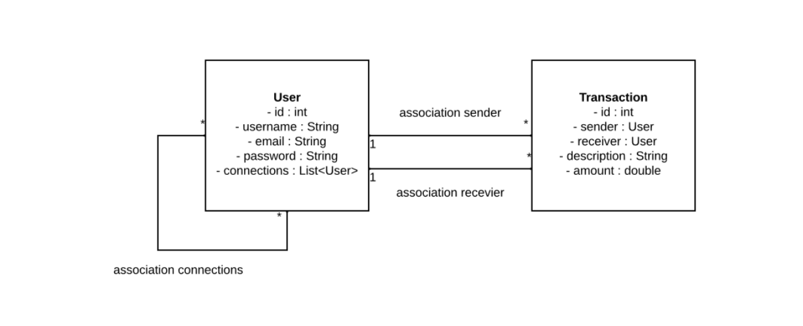

# Database installation 
## For development environment only
### Summary
- [Diagram references](#diagram-references)
- [Docker compose installation](#docker-install)
- [Manual installation](#manual-install)

There is no specific profiles for switching between a _local_ or a _Docker MySQL_ database in the development environment. This could be part of a future improvement to the project.

### <a id="diagram-references"></a># Diagram references
**Conceptual Data Model**



**Physical Data Model**


### <a id="docker-install"></a># Docker compose installation
The purpose of this configuration is to simulate the database as in production environment:
- without the complexity of MySQL Server configuration
- without lack of time

The creation of the database is automated by the Spring Boot Docker Compose dependency.

The only thing you have to do is to run the application with _dev_ profile (as specified in _Installation / Usage_ section of [README](../../README.md)).

**Important info**: the application could take several seconds to start at the very first run due to database creation. In this specific case: never stop your app until it has completely started!

The default credentials are:

| Option        | Value                     | Environment variable |
|:--------------|:--------------------------|:---------------------|
| Database name | paymybuddy_dev_martru     | MYSQL_DATABASE       |
| Database user | paymybuddy                | MYSQL_USER           |
| User password | paymybuddy                | MYSQL_PASSWORD       |
| Root password | VerySecretSoMuchSecureWow | MYSQL_ROOT_PASSWORD  |

#### - Database configuration
You are free to modify the database configuration in the [docker-compose.yml](../../scripts/docker-compose.yml).

Do not forget to also modify [application-dev.yml](../../src/main/resources/application-dev.yml) file in order to match the new credentials (if so).

#### - Database deletion
In order to properly delete database environment - _to reinitialise the installation or trash the project_ - you have to:
- Reach the docker-compose.yml root folder. _From this file_:
  ```shell
  cd ../../scripts/database
   ```
- Delete the Docker container
  ```shell
  docker-compose down
  ```
- Check the volumes mounted in your Docker machine
  ```shell
  docker volume ls
  ```
- Delete the project specific mounted volume (by default: **scripts_mysql-data**)
  ```shell
  docker volume rm scripts_mysql-data
  ```

### <a id="manual-install"></a># Manual installation
If you absolutely need to bind your own local or remote MySQL DB, you can do it in manual way.

First you have to install and configure a MySQL Server on your own ;)

Then, you have to edit the [application-dev.yml](../../src/main/resources/application-dev.yml) file:
- Change the _spring.datasource_ options _(url, username, password)_ with your own values
- Turn the _spring.docker.compose.enabled_ option to **false**
- Change the _spring.jpa.hibernate.ddl-auto_ option to cover your needs (**update** is a good choice)

Finally, you have to execute the sql scripts provided in _**scripts/database**_ folder:
- [db_schema_dev.sql](../../scripts/database/db_schema_dev.sql) to create the database and the tables
- [db_data_dev.sql](../../scripts/database/db_data_dev.sql) to populate your tables with initial data

### # Additional note

The sql script [schema.sql](../../src/main/resources/data/schema.sql) located under _./src/main/resources/data_ folder is **reserved for production environment only**.

_A document explaining production environment configuration will be created in the future._